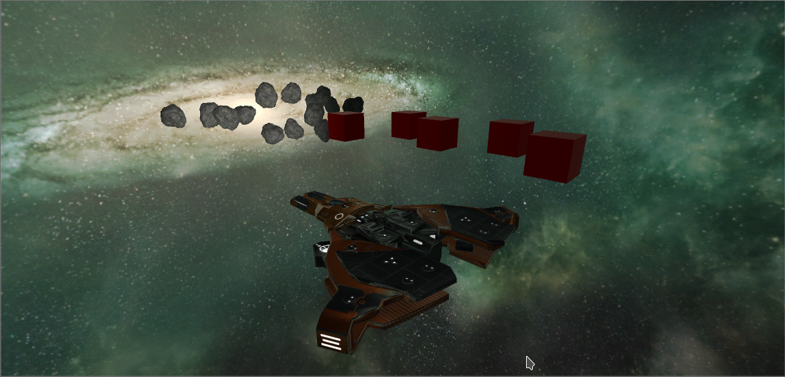
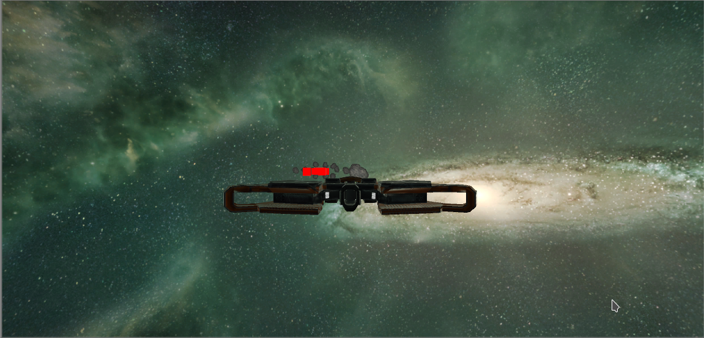
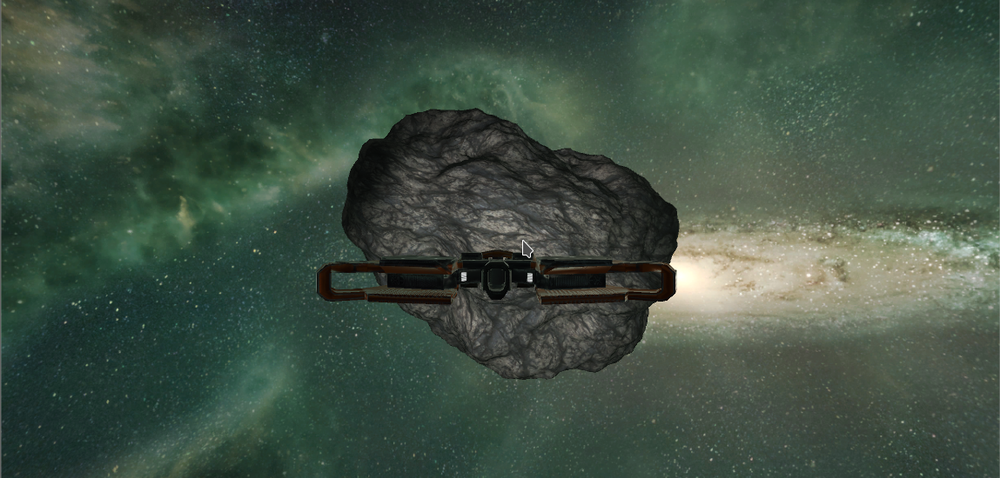
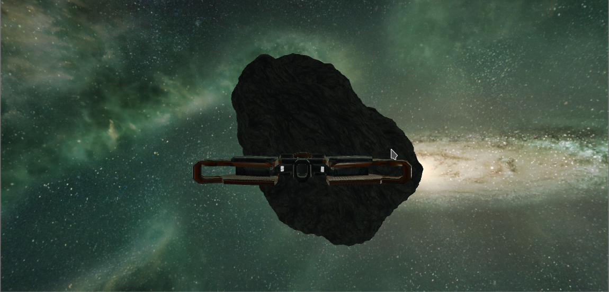

# Delegados, Eventos

### Crear un escenario básico para la escena del proyecto para la evaluación final.

El proyecto final del grupo al que pertenezco se basa en un juego de naves espaciales, he querido representar por lo tanto un escenario situado en el espacio junto a la presencia de asteroides, una nave espacial y unos cubos rojizos a los que he apodado _Cubos Sagrados_.



### Agregar dos tipos de GameObject de los que haya varias instancias en la escena.

Como ya se ha mencionado se han añadido dos tipos de GameObject a parte del jugador.

* **Asteroides**: Los asteroides decrementan la masa del jugador cuando este colisiona contra ellos y por lo tanto, decrementan su fuerza. Además cada vez que el jugador colisiona contra ellos, estos doblan su tamaño.
* **Cubos**: Los cubos incrementan la masa del jugador cuando este colisiona contra ellos.


### Implementar un controlador de escena usando el patrón delegado que gestione las siguientes acciones: 

* #### Si el jugador choca con un objeto de tipo A se incrementa su poder.

* #### Si el jugador choca con objetos de tipo B, todos los de ese tipo  sufrirán alguna transformación o algún cambio en su apariencia y  decrementarán el poder del jugador.

  Como se nos pide que utilicemos los *delegados* para esta práctica declaramos uno en el script que implementa la lógica de la nave al que llamamos _playerPower_.

  ```C#
  public class spaceshipLogic : MonoBehaviour {
  
  	public delegate void PlayerPower();
  	public PlayerPower playerPower;
  	// Use this for initialization
  	void Start () {
  
  	}
  
  	// Update is called once per frame
  	void Update () {
  
  	}
  }
  ```

  A este delegado se le asignará una función u otra dependiendo del objeto con el que colisione.

  ```c#
  public class asteroidLogic : MonoBehaviour {
  
  	// En qué medida se decrementa la masa.
  	private int massDecrement = 500;
  
  	void OnCollisionEnter(Collision collision){
  		// Si se colisiona con el jugador.
  		if(collision.gameObject.tag == "Player"){
  			GameObject player = GameObject.FindGameObjectWithTag("Player");
  			spaceshipLogic spaceshipLogicScript = player.GetComponent<spaceshipLogic>();
  			// Se obtiene su delegado y se asigna a la función para decrementar su masa.
  			spaceshipLogicScript.playerPower = decreasePower;
  			// Se ejecuta la función.
  			spaceshipLogicScript.playerPower();
  			// Se duplica el tamaño del asteroide.
  			transform.localScale *= 2;
  		}
  
  	}
  
  	void decreasePower(){
  		GameObject player = GameObject.FindGameObjectWithTag("Player");
  		Rigidbody playerRigidBody = player.GetComponent<Rigidbody>();
  		// Si hay suficiente masa se le resta el decremento.
  		if(playerRigidBody.mass > massDecrement){
  			playerRigidBody.mass -= massDecrement;
  		// Si no hay suficiente se iguala a cero para evitar masas 
  		// negativas y por tanto errores.
  		}else if(playerRigidBody.mass <= massDecrement){
  			playerRigidBody.mass = 1;
  		}
  
  	}
  ```

  *¿Por qué no se llama a la función a la que apunta el delegado desde el propio script de la nave?* Lo cual parece lo más obvio. Esto no se hace así sencillamente porque no se puede planificar el orden con el que los eventos _OnCollision_ se van a llamar, por lo que puede que se llame a la función a la que asignará el delegado sin antes haberla asignado.

Aquí dos imágenes para ilustrar como el objeto al colisionar cambia de tamaño:






Para el caso de los cubos el código es similar:

```c#
public class holyCubeLogic : MonoBehaviour {

	private int massIncrement = 100;

	void OnCollisionEnter(Collision collision){
		GameObject player = GameObject.FindGameObjectWithTag("Player");
		spaceshipLogic spaceshipLogicScript = player.GetComponent<spaceshipLogic>();
		spaceshipLogicScript.playerPower = increasePower;
	  	spaceshipLogicScript.playerPower();
	}

	void increasePower(){
		GameObject player = GameObject.FindGameObjectWithTag("Player");
		player.GetComponent<Rigidbody>().mass += massIncrement;
	}
}
```


#### Incorporar un elemento que sirva para encender o apagar un foco utilizando el teclado.

El elemento que hemos incorporado es una luz de tipo _spotlight_ que está ubicada en la posición de la nave y se enciende y apaga utilizando la teclas _F_.

```c#
public class spotLightScript : MonoBehaviour {

	// Use this for initialization
	void Start () {

	}

	// Update is called once per frame
	void Update () {

		transform.position = GameObject.FindGameObjectWithTag("Player").transform.position;

		if(Input.GetKeyDown(KeyCode.F)){
			GetComponent<Light>().enabled = !GetComponent<Light>().enabled;
		}
	}
}
```


Aquí dos imágenes ilustrando el encender y apagar del foco:


